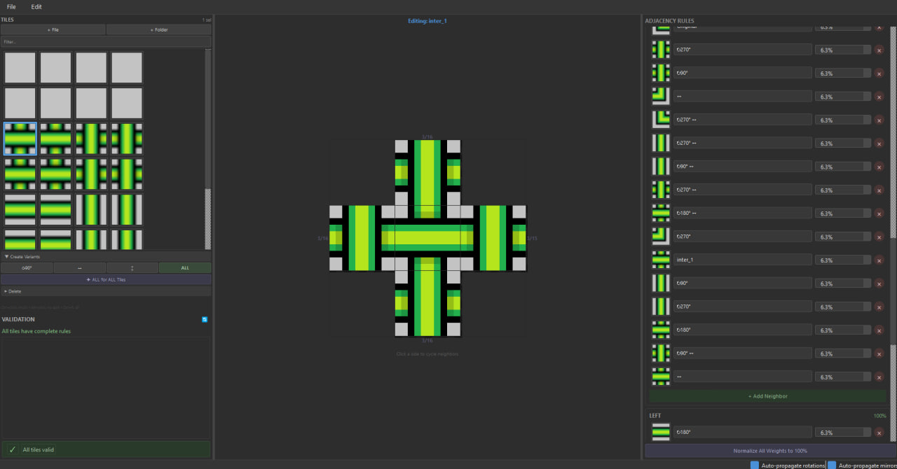
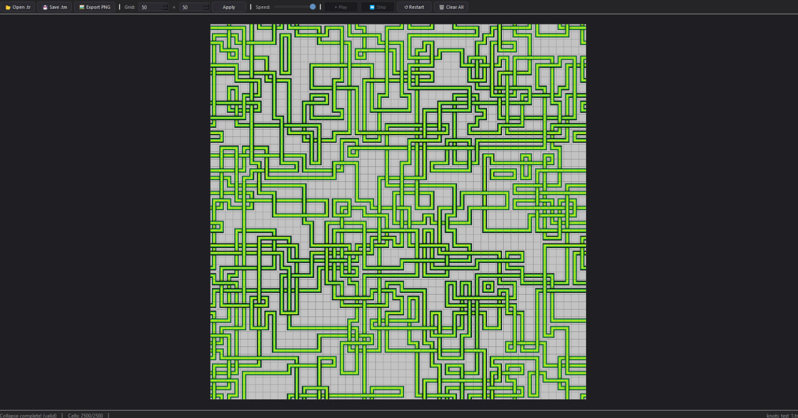

# 🧩 WFC Toolkit

A complete Wave Function Collapse toolkit for procedural tile map generation. Create tile atlases with adjacency rules, then generate infinite variations of coherent tile maps.


---

## 📦 What's Inside

| Tool | Description |
|------|-------------|
| **Atlas Editor** | Visual editor for creating tile atlases and defining adjacency rules |
| **WFC Viewer** | Real-time WFC solver with pre-placement, visualization, and export |

---

## ✨ Features

### Atlas Editor

- 🖼️ **Import tiles** — Load individual images or entire folders
- 🔄 **Transform variants** — Generate rotated (90°, 180°, 270°) and flipped (horizontal/vertical) versions
- 🔗 **Adjacency rules** — Define which tiles can neighbor each other on each side
- ⚖️ **Weighted probabilities** — Control how often each neighbor appears (0-100%)
- 🤖 **Auto-propagation** — Automatically generate rules for transformed variants
- ✅ **Validation** — Instant feedback on incomplete or invalid rule sets
- 💾 **Export .tr files** — Self-contained tile rule archives


[](## "Atlas Editor")  
### WFC Viewer

- 📂 **Load .tr files** — Parse tile rule archives created by the Atlas Editor
- 📐 **Configurable grid** — Set custom width × height before generation
- 🎯 **Pre-place tiles** — Click cells to lock specific tiles as constraints
- ▶️ **Real-time collapse** — Watch the WFC algorithm solve step-by-step
- ⏸️ **Playback controls** — Play, pause, step, restart, and speed adjustment
- 🔍 **Zoomable canvas** — Mouse wheel zoom, drag to pan
- 🖼️ **Export PNG** — Render the final grid as a single image
- 💾 **Save .tm files** — Export complete tile maps with embedded images

[](## "WFC Viewer)  


---

## 🚀 Getting Started

### Prerequisites

- Python 3.10 or higher
- pip (Python package manager)

### Installation

1. **Clone the repository**

```bash
git clone https://github.com/yourusername/wfc-toolkit.git
cd wfc-toolkit
```

2. **Install dependencies**

```bash
# For Atlas Editor
pip install -r atlas_editor/requirements.txt

# For WFC Viewer
pip install -r wfc_viewer/requirements.txt
```

### Running the Applications

**Atlas Editor:**
```bash
cd atlas_editor
python main.py
```

**WFC Viewer:**
```bash
cd wfc_viewer
python main.py
```

---

## 📖 Usage Guide

### Workflow Overview

```
┌─────────────────┐      ┌─────────────────┐      ┌─────────────────┐
│  Tile Images    │ ───► │  Atlas Editor   │ ───► │    .tr File     │
│  (PNG, JPG)     │      │  (Define Rules) │      │  (Tile Rules)   │
└─────────────────┘      └─────────────────┘      └────────┬────────┘
                                                           │
                                                           ▼
┌─────────────────┐      ┌─────────────────┐      ┌─────────────────┐
│   .tm / .png    │ ◄─── │   WFC Viewer    │ ◄─── │    .tr File     │
│   (Output)      │      │   (Generate)    │      │                 │
└─────────────────┘      └─────────────────┘      └─────────────────┘
```

### Step 1: Create Tiles

Design your tile set as individual square images (e.g., 16×16 or 32×32 pixels). Ensure edges match where tiles should connect.

### Step 2: Define Rules in Atlas Editor

1. Launch Atlas Editor
2. **Import tiles** via `File → Import File` or `File → Import Folder`
3. **Create variants** using the rotate (⟳) and flip (↔ ↕) buttons
4. **Define adjacency rules** — select a tile, then for each side (top/right/bottom/left), add valid neighbors and set their weights
5. **Validate** — check the validation panel for missing rules
6. **Export** — save as a `.tr` file

### Step 3: Generate Maps in WFC Viewer

1. Launch WFC Viewer
2. **Open** your `.tr` file
3. **Set grid size** (width × height)
4. **Pre-place tiles** (optional) — click cells to lock specific tiles
5. **Run WFC** — press Play to watch the algorithm solve
6. **Export** — save as PNG image or `.tm` tile map

---

## 📁 File Formats

### `.tr` (Tile Rules)

A self-contained ZIP archive containing:

```
archive.tr
├── atlas.json      # Tile metadata and adjacency rules
└── tiles/          # All tile images
    ├── grass.png
    ├── water.png
    └── ...
```

### `.tm` (Tile Map)

A ZIP archive storing generated/edited grids:

```
map.tm
├── map.json           # Grid state (which tile in each cell)
├── source_atlas.json  # Copy of original atlas for reference
└── tiles/             # All tile images
    └── ...
```

---

## 🏗️ Project Structure

```
wfc-toolkit/
├── atlas_editor/
│   ├── main.py              # Entry point
│   ├── requirements.txt
│   ├── src/
│   │   ├── core/            # Transform math, validation, serialization
│   │   ├── models/          # Data classes (Tile, Rule, Atlas)
│   │   └── ui/              # PySide6 widgets
│   └── test_tiles/          # Sample tile sets
│
├── wfc_viewer/
│   ├── main.py              # Entry point
│   ├── requirements.txt
│   ├── src/
│   │   ├── core/            # WFC engine, file loaders
│   │   ├── ui/              # Main window, grid canvas, dialogs
│   │   └── utils/           # Image utilities, PNG export
│   └── resources/           # Icons
│
└── README.md
```

---

## 🧮 How WFC Works

The Wave Function Collapse algorithm:

1. **Initialize** — Each grid cell starts with all possible tiles
2. **Observe** — Find the cell with lowest entropy (fewest possibilities)
3. **Collapse** — Randomly select one tile (weighted by probabilities)
4. **Propagate** — Remove invalid possibilities from neighboring cells based on adjacency rules
5. **Repeat** — Continue until all cells are collapsed or a contradiction is found

This toolkit uses the **Simple Tiled Model** variant where each cell contains exactly one tile and adjacency rules define valid neighbors per side.

---

## ⚙️ Tech Stack

- **Python 3.10+** — Core language
- **PySide6** — Qt6 bindings for cross-platform GUI
- **Pillow** — Image loading and manipulation

---
